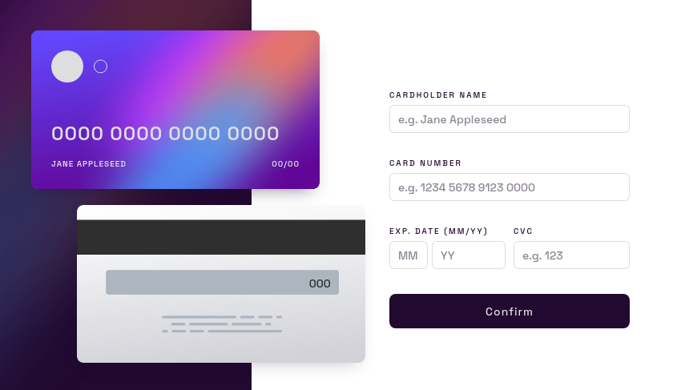

# :gift_heart: [Interactive Card Details](https://liarleycodie.github.io/Interactive-Card-Details/) :broken_heart:

### :books: __Learning:__
I even used a lot of `array methods` that although I knew, I didn't remember how to use them.

I used some tests with `regex` to validate the `name input`.
Which out of curiosity, I understand very little. But with this project, I noticed how interesting it is.

### :feet: __Summary of the process:__
I started with HTML and CSS. I quote the two together, because I was writing each file in a row, one from the other.

98% of the CSS was written using the `SCSS` preprocessor.

_Then I switched IDEs and made adjustments directly to the CSS sheet._

I even used `flexbox` a lot in union with `grid`

The main container itself uses `grid`

I always start the project by designing the mobile interface first.

Then I adjust the media-queries for each resolution.

After having all the HTML and CSS written, I start with JavaScript (which is better explained in the final remarks... it was stressful).

### :speech_balloon: __Final remarks:__
I spent at least 2 weeks or more trying to complete this project.

:sheep: I obviously didn't go for days at a time as I was so stressed. So I had some
intervals in the meantime. If I were to mark _precisely_ the time. I spent at least
like 5 days (not so precisely, those 5 days were distributed in 2 weeks lol)

:skull: And still, I couldn't complete it _completely_.

I stopped the project at its current stage because looking at the lines of code was being stressful.

I'm glad I at least did everything you can check out.

:snail: But I'm saddened by my perfectionism.

Two isolated prototypes were executed.

:hibiscus: The first one was for [name input validation](https://liarleycodie.github.io/Input-Validation/).

:ghost: And the second one, but not published, was a clone of the previous validation test, but with some modifications for the `card number input`

:triangular_ruler: I cared about the smallest details. But still I did not get something so interesting.

But that's it.

> :yum: I emphasize that the project still has several bugs. So, don't be surprised by oddities.

:pushpin: One more challenge proposed by Frontend mentor completed! (or almost)

